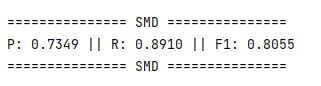

## Datasets
1. PSM: https://dl.acm.org/doi/abs/10.1145/3447548.3467174
   .
2. MSL: https://arxiv.org/pdf/1802.04431.pdf.
3. MIT-BIH: https://www.ahajournals.org/doi/epub/10.1161/01.CIR.101.23.e215.
4. SMD: https://netman.aiops.org/wp-content/uploads/2019/08/OmniAnomaly_camera-ready.pdf.
5. SWaT: https://ieeexplore.ieee.org/abstract/document/7469060.

## Get Started

1. Install Python 3.9.13, PyTorch 1.11.0.

2. Train and evaluate. You can reproduce the experiment results as follows:

   ```python
   python main.py --dataset SMD --q 0.005
   ```

## Main Result

The GPU we use is NVIDIA RTX3090 24GB. The following is the F1-score obtained after testing the SMD dataset.




 
