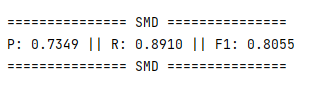

# TADAN

**TADAN: Teacher-Assisted Diffusion with Adaptive Noise for Time Series Anomaly Detection**

Time series data often contain instances with similar variances but differing anomaly statuses, presenting significant challenges for conventional anomaly detection methods. To address this issue, we propose a Teacher-Assisted Diffusion model with Adaptive Noise (TADAN) for robust time-series anomaly detection. By conceptualizing anomalies as noise, we devise a novel teacher-assisted denoising student model that leverages the robust denoising capabilities of diffusion models under the guidance of a teacher to eliminate anomalies. This design enables the effective differentiation of anomalies through reconstruction errors between the denoised data and the original input. To further enhance the denoising performance, we introduce adaptive directional noise to replace the commonly used Gaussian noise for diffusion models, specifically designed to target and erode anomalous sections. In addition, we introduce a new multi-view anomaly scoring mechanism to capture subtle deviations at various levels to improve detection accuracy. Extensive experimental results on real-world datasets demonstrate that TADAN outperforms state-of-the-art benchmarks.

## 	Get Started

1. Install Python 3.9.13, PyTorch 1.11.0.

2. Train and evaluate. You can reproduce the experiment results as follows:

   ```python
   python main.py --dataset SMD --q 0.005
   ```

## Main Result

The GPU we use is NVIDIA RTX3090 24GB. The following is the F1-score obtained after testing the SMD dataset.




 
